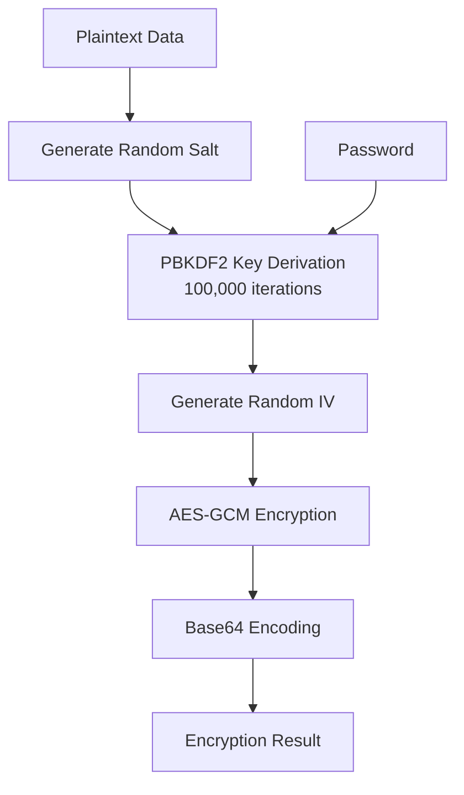

# Encryption API

The core encryption API provides low-level functions for encrypting and decrypting data using AES-GCM encryption with
PBKDF2 key derivation.

## Encryption Function

`encrypt(data: string, password: string)`

Encrypts a string using the provided password.

**Parameters:**

- `data` (string): The plaintext data to encrypt
- `password` (string): The encryption password

**Returns:** `Promise<EncryptionResult>`

**EncryptionResult Structure:**

```typescript
interface EncryptionResult {
    encryptedData: string;  // Base64-encoded encrypted data
    iv: string;            // Base64-encoded initialization vector
    salt: string;          // Base64-encoded salt
}
```

**Example:**

```javascript
import {encrypt} from 'bvault-js';

async function encryptSensitiveData() {
    const sensitiveInfo = 'Credit card: 1234-5678-9012-3456';
    const password = 'strong-password-2024';

    const result = await encrypt(sensitiveInfo, password);

    // Store these values for decryption
    console.log('Encrypted:', result.encryptedData);
    console.log('IV:', result.iv);
    console.log('Salt:', result.salt);

    return result;
}
```

## Decryption Function

`decrypt(encryptedData: string, password: string, iv: string, salt: string)`

Decrypts data using the original password and stored parameters.

**Parameters:**

- `encryptedData` (string): Base64-encoded encrypted data
- `password` (string): The original encryption password
- `iv` (string): Base64-encoded initialization vector
- `salt` (string): Base64-encoded salt

**Returns:** `Promise<string>`

**Example:**

```javascript
import {decrypt} from 'bvault-js';

async function decryptData() {
    const encryptedData = '...'; // From previous encryption
    const iv = '...';           // From previous encryption
    const salt = '...';         // From previous encryption
    const password = 'strong-password-2024';

    try {
        const decrypted = await decrypt(encryptedData, password, iv, salt);
        console.log('Decrypted data:', decrypted);
        return decrypted;
    } catch (error) {
        console.error('Decryption failed - wrong password or corrupted data');
        return null;
    }
}
```

## Under the Hood

### Encryption Process



### Technical Details

- **Algorithm**: AES-GCM with 256-bit keys
- **Key Derivation**: PBKDF2 with SHA-256, 100 thousand iterations
- **IV Length**: 12 bytes (96 bits)
- **Salt Length**: 16 bytes (128 bits)
- **Authentication**: Built-in authentication with GCM mode
- **Output Encoding**: Base64 for all values

## Advanced Usage

### Batch Encryption

```javascript
async function encryptMultipleItems(items, password) {
    const results = [];

    for (const item of items) {
        const encrypted = await encrypt(JSON.stringify(item), password);
        results.push({
            data: item,
            encrypted: encrypted.encryptedData,
            iv: encrypted.iv,
            salt: encrypted.salt
        });
    }

    return results;
}
```

### Custom Error Handling

```javascript
import {encrypt, decrypt, EncryptionError, DecryptionError} from 'bvault-js';

async function robustEncrypt(data, password) {
    if (!data || !password) {
        throw new Error('Data and password are required');
    }

    if (password.length < 8) {
        throw new Error('Password must be at least 8 characters');
    }

    try {
        return await encrypt(data, password);
    } catch (error) {
        if (error instanceof EncryptionError) {
            console.error('Cryptographic operation failed');
        }
        throw error;
    }
}
```

### Performance Considerations

```javascript
// For large data, consider chunking
async function encryptLargeData(largeString, password, chunkSize = 10000) {
    const chunks = [];
    for (let i = 0; i < largeString.length; i += chunkSize) {
        chunks.push(largeString.slice(i, i + chunkSize));
    }

    const encryptedChunks = [];
    for (const chunk of chunks) {
        const encrypted = await encrypt(chunk, password);
        encryptedChunks.push(encrypted);
    }

    return encryptedChunks;
}
```

## Security Notes

- **Password Strength**: Always use strong, unique passwords
- **Parameter Storage**: Safely store IV and salt with encrypted data
- **Error Handling**: Never expose decryption errors to end users
- **Memory Management**: Clear sensitive data from memory when done

```javascript
// Safe memory cleaning example
function secureCleanup() {
    // Overwrite sensitive data in variables
    let sensitive = 'secret data';
    sensitive = ''.padStart(sensitive.length, '0');

    // Force garbage collection (where supported)
    if (global.gc) {
        global.gc();
    }
}
```

Continue to [Secure Storage API](/docs/core-api/secure-storage) for the encrypted localStorage wrapper.
