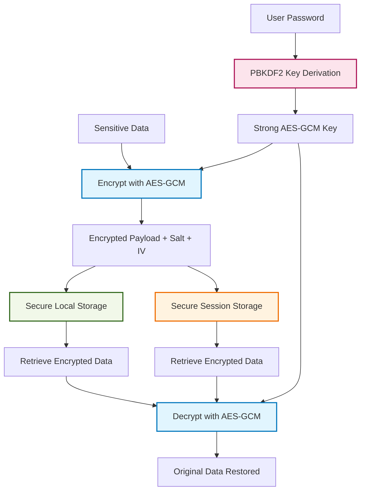

# bVault-js - Secure Frontend Encryption Library

    

bVault-js is a type-safe, lightweight, zero-dependency cryptographic library designed for secure encryption and decryption in browser environments. It provides a simple yet powerful API for protecting sensitive data using industry-standard encryption algorithms.

## Key Features

- **AES-GCM 256-bit Encryption**: Military-grade encryption for maximum security
- **Password-based Key Derivation**: PBKDF2 with 100,000 iterations for secure key generation
- **Automatic Parameter Generation**: Built-in salt and IV generation
- **Secure Local Storage Wrapper**: Encrypted localStorage with automatic encryption/decryption
- **TypeScript Support**: Full type safety with comprehensive type definitions
- **Zero Dependencies**: Lightweight and self-contained
- **Browser-First**: Optimized for modern web browsers using Web Crypto API
---
title: Why Choose bVault-js?
sidebar_position: 2
---

## Why Choose bVault-js?

bVault-js is designed to bring **enterprise-grade encryption** directly into your browser applications — without the
bloat, without extra dependencies.

It helps you **securely store, retrieve, and manage sensitive data** using the Web Crypto API, while keeping a simple,
type-safe, developer-friendly API.

---

## 🔑 Key Advantages

- **AES-GCM 256-bit encryption**: Industry-standard, modern symmetric encryption.
- **PBKDF2 with 100,000 iterations**: Derives strong encryption keys from user-provided passwords.
- **Zero dependencies**: Lightweight, portable, and safe to use in modern browsers.
- **Secure Local & Session Storage**: Wraps `localStorage` and `sessionStorage` so you can transparently encrypt/decrypt app data.
- **Cross-framework support**: Works seamlessly with React, Vue, Svelte, and vanilla JS.

---

## 🛡️ How It Works

bVault-js provides **two secure storage wrappers**:

- `secureLocalStorage` → persists data across browser sessions (until cleared).
- `secureSessionStorage` → keeps sensitive data only for the current session (cleared when the tab/browser closes).

This gives developers flexibility in choosing **where and how** data should be kept encrypted.

### ⬇️ Encryption & Storage Flow

